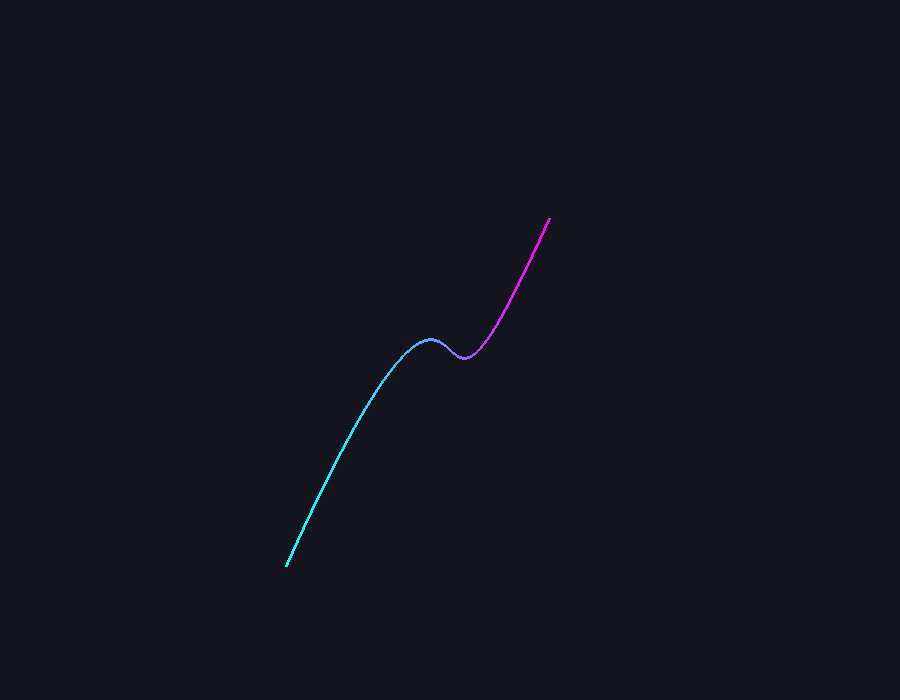
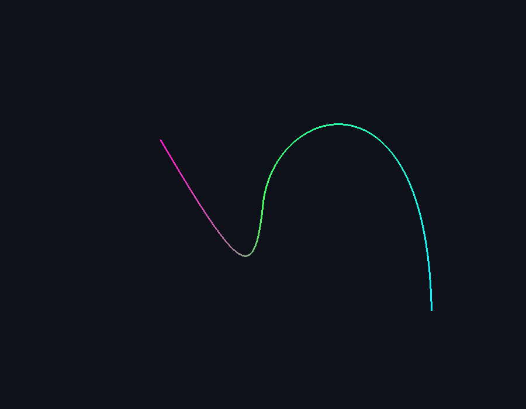

# Práctica 12: Curvas de Bézier paramétricas en 3D

**Universidad Nacional de San Antonio Abad del Cusco**<br>
**Asignatura:** Computación Gráfica I<br>
**Tema:** generación de curvas paramétricas en 3D y evaluación de curvas de
Bézier cúbicas en el *vertex shader*.

Este directorio contiene la reproducción corregida del ejemplo presentado en
`P12.pdf` y la solución completa de las actividades propuestas. La curva no se
calcula punto por punto en la CPU: el programa envía valores del parámetro
`t` y cuatro puntos de control a la GPU, donde el *vertex shader* evalúa los
polinomios de Bernstein.

## Objetivos

- Representar una curva paramétrica en el espacio tridimensional.
- Evaluar una curva de Bézier cúbica en el *vertex shader*.
- Transferir puntos de control desde C++ mediante variables `uniform`.
- Construir una curva compuesta por dos segmentos cúbicos.
- Garantizar continuidad de posición \(C^0\) y de primera derivada \(C^1\).
- Modificar los extremos de la curva en los ejes X, Y y Z mediante el teclado.
- Mantener una implementación modular y liberar correctamente los recursos de
  OpenGL.

## Estructura del proyecto

```text
labo12/
├── P12.pdf                         # Enunciado oficial de la práctica
├── CMakeLists.txt                  # Configuración de compilación
├── README.md                       # Documentación del proyecto
├── curve.vert                      # Vertex shader del ejemplo 3.1
├── curve.frag                      # Fragment shader del ejemplo 3.2
├── mainCurves.cpp                  # Aplicación base del ejemplo 3.3
├── actividadBezierCompuesta.cpp    # Solución del ejercicio propuesto
├── bezierComun.hpp                 # Funciones y shaders reutilizables
├── capturaCurvaBase.png            # Resultado del ejemplo base
├── capturaBezierCompuesta.png      # Resultado de la actividad
├── build/
│   ├── mainCurves
│   └── actividadBezierCompuesta
└── informe/
    ├── informe.tex                 # Código fuente del informe
    └── informe.pdf                 # Informe técnico compilado
```

## Requisitos

El proyecto utiliza:

- C++17
- CMake 3.10 o superior
- OpenGL 3.3 Core
- GLEW
- GLFW
- GLM
- LaTeX con TikZ y `listings`, únicamente para generar el informe

En Ubuntu o Debian se pueden instalar las dependencias principales con:

```bash
sudo apt update
sudo apt install build-essential cmake libglew-dev libglfw3-dev libglm-dev
```

Para compilar el informe:

```bash
sudo apt install texlive-latex-base texlive-latex-extra texlive-lang-spanish
```

## Compilación

Desde la raíz del repositorio:

```bash
cd labo12
cmake -S . -B build
cmake --build build -j4
```

Se generan dos ejecutables:

```text
build/mainCurves
build/actividadBezierCompuesta
```

Para limpiar y configurar nuevamente, puede eliminarse solamente el directorio
`labo12/build` y repetir los comandos anteriores.

## Ejemplo base del PDF

Ejecute:

```bash
./build/mainCurves
```

El ejemplo utiliza los puntos:

```text
P0 = (-10, -5,  0)
P1 = ( -5, 10,  5)
P2 = (  5,-10, -5)
P3 = ( 10,  5,  0)
```

La CPU genera 201 valores entre `0.0` y `1.0`, correspondientes a 200
subdivisiones:

```cpp
for (int i = 0; i <= 200; ++i) {
    t = static_cast<float>(i) / 200.0f;
}
```

Cada valor se almacena como un único `float` en el VBO. El *vertex shader*
recibe ese valor mediante el atributo `aT` y calcula la posición espacial.



## Fundamento matemático

Una curva de Bézier cúbica se define mediante cuatro puntos de control:

\[
P(t)=(1-t)^3P_0+3(1-t)^2tP_1+3(1-t)t^2P_2+t^3P_3,
\quad 0\leq t\leq1
\]

Sus polinomios de Bernstein son:

```text
B0(t) = (1 - t)^3
B1(t) = 3(1 - t)^2 t
B2(t) = 3(1 - t)t^2
B3(t) = t^3
```

La implementación equivalente en GLSL es:

```glsl
float t = aT;
float u = 1.0 - t;

float b0 = u * u * u;
float b1 = 3.0 * u * u * t;
float b2 = 3.0 * u * t * t;
float b3 = t * t * t;

vec3 position = b0 * P0 + b1 * P1 + b2 * P2 + b3 * P3;
```

Los puntos `P0`, `P1`, `P2` y `P3` se transfieren como `uniform vec3`. La
posición final se transforma con las matrices `model`, `view` y `projection`.

## Actividad: curva de Bézier compuesta

Ejecute:

```bash
./build/actividadBezierCompuesta
```

La solución construye dos segmentos:

```text
Segmento A: A0, A1, A2, A3
Segmento B: B0, B1, B2, B3
```

El VBO no contiene dos conjuntos de posiciones. Contiene 241 valores de `t`
para 240 subdivisiones. El mismo VAO se dibuja dos veces:

1. Se envían `A0`, `A1`, `A2` y `A3`, y se dibuja el segmento A.
2. Se envían `B0`, `B1`, `B2` y `B3`, y se dibuja el segmento B.

Este procedimiento representa la duplicación modular del dominio
\(t\in[0,1]\): cada segmento posee su propio recorrido completo del parámetro,
pero ambos reutilizan el mismo buffer.

## Continuidad \(C^0\) y \(C^1\)

Para que los segmentos se unan en la misma posición se exige:

\[
B_0=A_3
\]

Las derivadas en los extremos de dos curvas cúbicas son:

\[
C_A'(1)=3(A_3-A_2)
\]

\[
C_B'(0)=3(B_1-B_0)
\]

La relación solicitada por el PDF es:

\[
B_1=A_3+(A_3-A_2)
\]

Como `B0 = A3`, se obtiene:

\[
B_1-B_0=A_3-A_2
\]

Por tanto:

\[
C_B'(0)=3(B_1-B_0)=3(A_3-A_2)=C_A'(1)
\]

La posición y la primera derivada coinciden en la unión. Esto garantiza
continuidad estricta \(C^1\), sin quiebres visuales.

En C++ se recalcula en cada cuadro:

```cpp
const glm::vec3 b0 = a3;
const glm::vec3 b1 = a3 + (a3 - a2);
```



## Controles interactivos

Primero se selecciona el extremo que se desea modificar:

| Tecla | Acción |
|---|---|
| `1` | Seleccionar el punto extremo `A0` |
| `2` | Seleccionar el punto extremo `B3` |
| `LEFT` | Disminuir la coordenada X |
| `RIGHT` | Aumentar la coordenada X |
| `UP` | Aumentar la coordenada Y |
| `DOWN` | Disminuir la coordenada Y |
| `W` | Aumentar la profundidad Z |
| `S` | Disminuir la profundidad Z |
| `ESC` | Cerrar la aplicación |

El desplazamiento se multiplica por el tiempo transcurrido entre cuadros. De
esta manera la velocidad del movimiento no depende de la tasa de refresco.
Después de procesar las teclas, los nuevos puntos se envían nuevamente como
`uniforms`, por lo que la deformación se visualiza inmediatamente.

## Pipeline de renderizado

```text
CPU
 │
 ├─ Genera valores escalares t en [0,1]
 ├─ Actualiza los puntos de control
 ├─ Calcula B0 y B1 para mantener C1
 └─ Envía matrices y puntos mediante uniforms
          │
          ▼
VERTEX SHADER
 │
 ├─ Evalúa los cuatro polinomios de Bernstein
 ├─ Calcula la posición 3D de cada muestra
 └─ Aplica model × view × projection
          │
          ▼
RASTERIZACIÓN DE GL_LINE_STRIP
          │
          ▼
FRAGMENT SHADER
 └─ Aplica el degradado de color según t
```

## Relación con la rúbrica

| Criterio | Evidencia en el proyecto | Puntaje |
|---|---|---:|
| Matemática del pipeline | Ecuación de Bézier, buffer de `t`, reutilización del VAO y evaluación en el *vertex shader* | 5 |
| Continuidad \(C^1\) estricta | Cálculo automático de `B0`, `B1` y demostración mediante derivadas | 5 |
| Control dinámico 3D | Selección de `A0`/`B3`, movimiento X/Y/Z y actualización de `uniforms` | 4 |
| Reporte técnico | Informe LaTeX, diagrama algorítmico y capturas etiquetadas | 4 |
| Buenas prácticas C++ | Funciones reutilizables, comprobación de shaders y liberación de recursos | 2 |
| **Total** | | **20** |

## Buenas prácticas aplicadas

- El atributo `t` se declara como un `float` mediante
  `glVertexAttribPointer(0, 1, GL_FLOAT, ...)`.
- El tamaño del VBO se calcula con `values.size() * sizeof(float)`.
- El buffer se crea una sola vez con `GL_STATIC_DRAW`.
- Los puntos dinámicos se actualizan mediante `uniforms`.
- Las operaciones comunes están centralizadas en `bezierComun.hpp`.
- Se comprueba la compilación y el enlace de los shaders.
- Al finalizar se eliminan el VAO, VBO y programa de shaders.
- La ventana se destruye y GLFW se termina correctamente.

## Generación del informe

Desde el directorio `labo12`:

```bash
cd informe
pdflatex informe.tex
pdflatex informe.tex
```

El segundo paso actualiza correctamente las referencias y numeración. El
resultado se genera en:

```text
labo12/informe/informe.pdf
```

## Errores corregidos respecto al texto extraído del PDF

El PDF contiene algunos errores tipográficos producidos por la edición o
extracción del texto. En el proyecto se utilizan las formas válidas:

```text
#version 330 core
GL_FRAGMENT_SHADER
glGenVertexArrays
glBindVertexArray
glVertexAttribPointer
glEnableVertexAttribArray
glfwMakeContextCurrent
glfwWindowShouldClose
```

Estas correcciones no cambian el algoritmo solicitado; únicamente permiten que
el ejemplo compile y se ejecute correctamente.

## Solución de problemas

### No se encuentra GLEW, GLFW o GLM

Instale los paquetes indicados en la sección de requisitos y vuelva a ejecutar
CMake.

### La ventana no abre

La aplicación requiere una sesión gráfica con soporte para OpenGL 3.3. No se
puede visualizar directamente en una terminal sin servidor gráfico.

### La curva no se mueve

Ejecute `actividadBezierCompuesta`, seleccione primero el extremo con `1` o `2`
y mantenga presionada una tecla de movimiento.

### CMake conserva una configuración anterior

Elimine únicamente `labo12/build`, vuelva a crear el directorio con
`cmake -S . -B build` y compile nuevamente.
